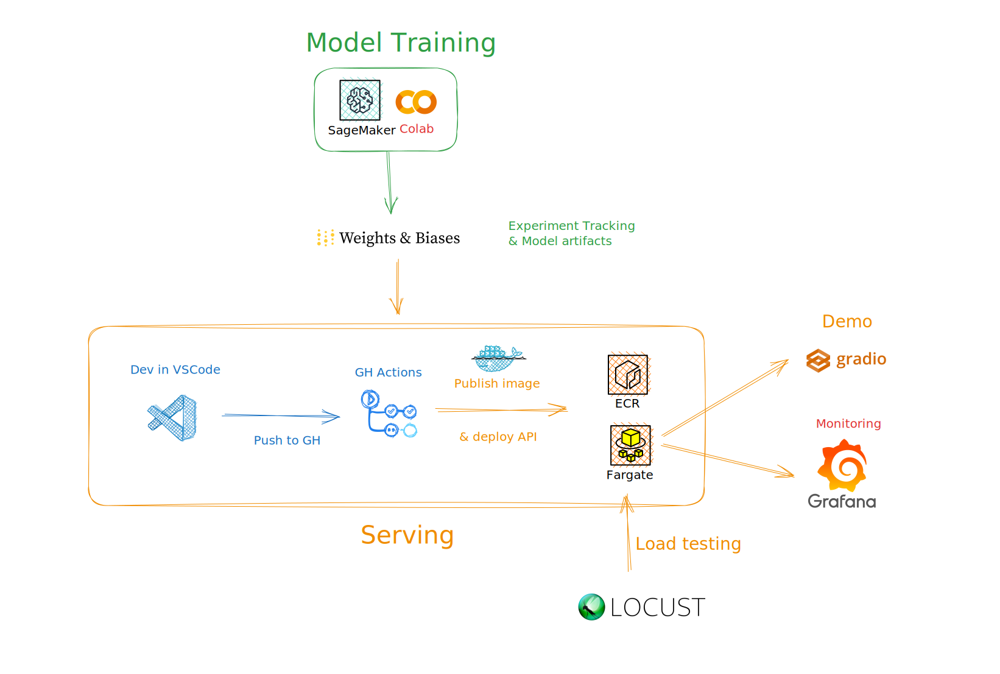
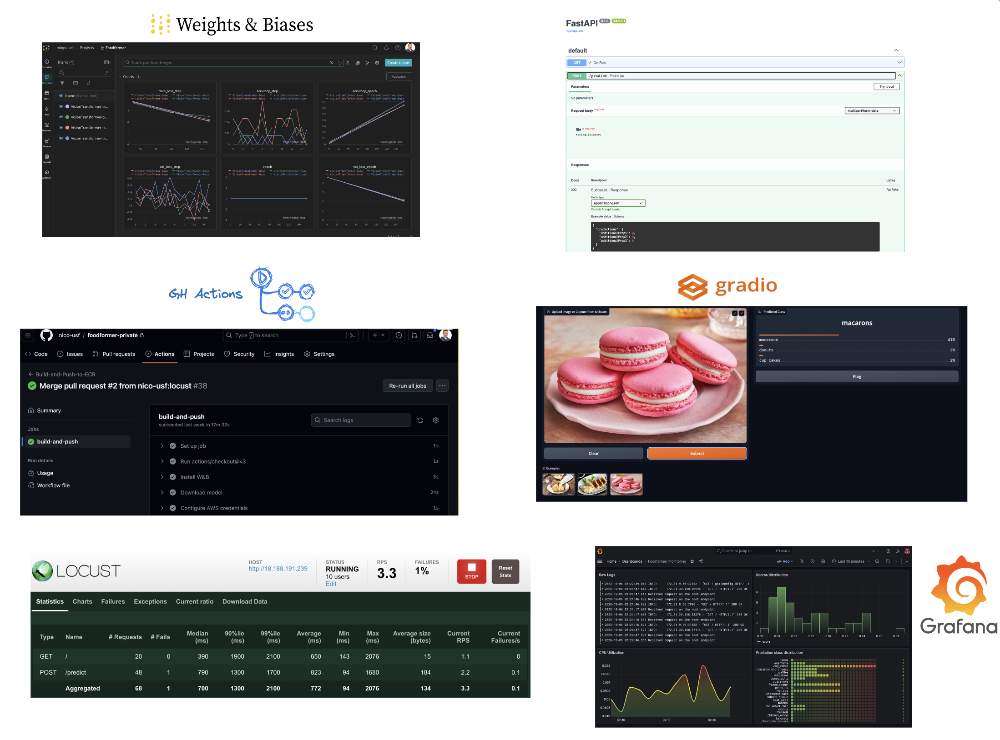

# MSDS - MLOps course - Foodformer 

[](https://www.python.org/downloads/release/python-31011/)
[](https://colab.research.google.com/github/nico-usf/foodformer)

Home of the Foodformer MLOps project. The goal of this project is to create a food classification app powered by a Vision Transformer. The repo showcases several MLOps concepts:
- 👩‍💻 Model development on GPU instances with [AWS SageMaker](https://aws.amazon.com/sagemaker/)
- 🧪 Experiment tracking and artifacts management with [Weights & Biases](https://wandb.ai/site)
- 🚀 API development ([FastAPI](https://fastapi.tiangolo.com/), [Docker](https://www.docker.com/)) and deployment ([AWS Fargate](https://aws.amazon.com/fargate/), [AWS ECR](https://aws.amazon.com/ecr/))
- 🖼️ Setting up a demo environment with [GradIO](https://www.gradio.app/)
- ⚙️ Continuous Deployment with [GitHub Actions](https://github.com/features/actions)
- 🖥️ Operational and functional monitoring with [Grafana](https://grafana.com/)
- 🏋️ Load testing with [Locust](https://locust.io/)

Here is the complete architecture diagram with tools icons:



and the different visual interfaces to the model:




## Development

To setup this repo locally, run `./setup.sh`, it will simply install the dependencies and pre-commit hooks. 

I recommend creating a virtual environment, see intructions [in the FAQ section](#faq).


## Testing the API

You can use API platforms like Postman or Insomnia, the Swagger interface of the API (http://localhost:8080/docs), or the command-line tool `curl`:

- for the healthcheck endpoint: `curl http://localhost:8080`
- for a post endpoint called `predict`, with an image called `image.jpg` in the current working directory:

```bash
curl -X 'POST' \
  'http://0.0.0.0:8080/predict' \
  -H 'accept: application/json' \
  -H 'Content-Type: multipart/form-data' \
  -F 'file=@image.jpg;type=image/jpeg'
```

## Deployment to AWS Fargate

Fargate is a serverless deployment solution for Docker containers. Deploying a Docker image to Fargate requires uploading the image to a registry like AWS ECR. While redeployments are automated through GH Actions, initially creating the Fargate service requires following the instructions below.

### Build and push the Docker image manually
 
In a terminal:

- Build the dockerfile: `docker build -t foodformer .`
- Fetch and store your AWS account id and AWS region: `export AWS_ACCOUNT_ID=$(aws sts get-caller-identity --query "Account" --output text) && export AWS_REGION='us-east-2'`
- Authenticate with AWS ECR: `aws ecr get-login-password --region $AWS_REGION | docker login --username AWS --password-stdin $AWS_ACCOUNT_ID.dkr.ecr.$AWS_REGION.amazonaws.com` -> You should see the following message: "Login Succeeded"
- Create a repo in ECR: `aws ecr create-repository --repository-name foodformer --image-scanning-configuration scanOnPush=true --region $AWS_REGION`
- Tag and push you Docker image: `docker tag foodformer:latest $AWS_ACCOUNT_ID.dkr.ecr.$AWS_REGION.amazonaws.com/foodformer` followed by `docker push $AWS_ACCOUNT_ID.dkr.ecr.$AWS_REGION.amazonaws.com/foodformer` (this command will take a while, it's uploading the entire Docker image to ECR).

### Deploy API container with Fargate

Follow [this guide](./guides/fargate/create-cluster-and-task.md) to create the required services in the AWS Console.

## Next Steps
- Canary Deployment and A/B tests: create a new GH Action and setup a Load Balancer in AWS to unlock canary deployments
- Auto-scaling: change the settings in AWS ECS to enable inference auto-scaling.
- Serverless GPU: replace Fargate serving with [AWS SageMaker Serverless Inference]([url](https://docs.aws.amazon.com/sagemaker/latest/dg/serverless-endpoints.html))
- 
## FAQ

### What is this project?

This project is part of the [MLOps course the Masters of Science in Data Science of the University of San Francisco](https://catalog.usfca.edu/preview_course_nopop.php?catoid=38&coid=562876).

### How to create a virtual environment?

With [PyEnv](https://github.com/pyenv/pyenv)) you can run the following (MacOS):

```bash
brew install pyenv
pyenv init
pyenv install -s 3.10.10
pyenv virtualenv 3.10.10 foodformer
pyenv activate foodformer
pyenv local foodformer
```

Pyenv will automatically load the correct virtual environment when you `cd` into this directory, by reading the `.python-version` file created by the `pyenv local` step.

### How to host the Locust load testing app in the cloud?

One of the simplest and cheapest ways to deploy a lightweight container to the cloud is to use [fly.io](https://fly.io/). Sign-up, then run `fly deploy` from `load_testing` folder.

### How to deploy the demo?

When running from your laptop, you can share it publicly by adding `share=True` to the parameters of the `launch()` command. To create a persist demo, you can follow [this short guide](https://www.gradio.app/guides/sharing-your-app#hosting-on-hf-spaces) to host it on HuggingFace Spaces. 
